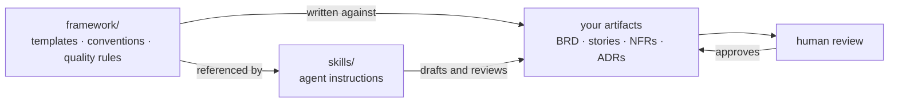

# analyst-toolkit

Templates, quality rules and agent skills for requirements work - built so that
the standards a human reviews against and the instructions an agent follows are
the same text. Plus a reference implementation showing what happens when those
artifacts are produced by a system rather than by hand.

> **Work in progress.** This is v0.2 and is being built in the open. Files will
> change, structure will move, and several planned parts are not here yet - see
> [Roadmap](#roadmap). Nothing is stable enough to depend on without reading it
> first. Feedback and disagreement are welcome; open an issue.

---

📖 **[Read the story behind this toolkit](https://ai-systems-analyst-toolkit.notion.site/AI-Systems-Analyst-Toolkit-3bbcf90fc550803b8c00dffd882cffa8)** - why it exists, what broke during testing, and what that changed.

---

## The problem

Most teams have both of these, separately: a set of documentation standards
nobody quite follows, and a growing pile of prompts that generate requirements
in whatever shape the prompt happened to describe. The standards are read once.
The prompts are never reviewed at all. Within a few months they say different
things, and the artifacts that come out satisfy neither.

Adding an AI drafting step to that arrangement does not fix it. Generated
requirements read as complete because fluent text reads as complete - gaps get
filled with plausible values instead of being flagged, and the resulting number
becomes a commitment the moment somebody reads it.

This repository is one attempt at the other arrangement: the templates and the
agent instructions are the same artifacts, and nothing certifies its own output.

---

## How it fits together

Skills point at the framework files rather than restating their contents.
Updating a template changes what the skills do, without editing any skill.

---

## Contents

| | What it is |
|---|---|
| [`framework/`](framework) | Templates for BRDs, user stories, NFR catalogues and decision records; identifier conventions; a definition of ready and a review checklist |
| [`skills/`](skills) | Three agent skills that draft, interview and review against those templates. [Start here](skills/README.md) if you have not used a skill before |
| [`pipeline/`](pipeline) | A reference implementation of a request-to-documentation pipeline, with the design record explaining what is deliberately not automated. [Start here](pipeline/README.md) |
| [`NOTES.md`](NOTES.md) | What went wrong while building this. The most useful file in the repository |

### The skills

| Skill | Does |
|---|---|
| [`brd-drafter`](skills/brd-drafter) | Turns an informal request into a BRD draft, flagging gaps rather than filling them. Refuses to draft from a request that names only a solution |
| [`nfr-interrogator`](skills/nfr-interrogator) | Interviews across eight quality categories and assembles a catalogue. Records unknowns with owners instead of supplying conventional values |
| [`requirements-smell-detector`](skills/requirements-smell-detector) | Reviews requirements for ambiguity and unverifiable statements, returning findings with suggested reformulations - not a rewritten document |

### The pipeline block

`framework/` holds the templates. `skills/` produces and reviews individual
artifacts. [`pipeline/`](pipeline) is the operational layer: what happens when
artifacts are produced continuously, by a system, at a volume where the binding
constraint stops being drafting and becomes review.

A reference implementation of a request-to-documentation pipeline - Slack for
intake, n8n for orchestration, a registry for state, an LLM agent for drafting,
a documentation platform for publication - built around one constraint: **no
automated actor can publish.** The agent holds no credentials, cannot reach the
registry or the documentation platform, and every write is performed on its
behalf. There is no timeout that approves and no request type that skips review.

Alongside the implementation, the design record: twelve ADRs with their rejected
alternatives, a routing matrix written to be argued with by the people it routes
to, an agent contract with its own weaknesses stated, a measurement design that
reports no numbers, and a document on what is held by humans on purpose.

The tooling is real and named. The business context is synthetic. The workflow
export is sanitised and will not run as supplied.

---

## Quick start

**To use the templates**, take what you need from [`framework/`](framework).
Plain Markdown with the guidance written into each section - no tooling, no
setup. Read
[`conventions/naming-and-ids.md`](framework/conventions/naming-and-ids.md) first
if you plan to use more than one.

**To use a skill**, follow [`skills/README.md`](skills/README.md). Roughly five
minutes, and it covers three ways to do it including one that requires no
installation at all.

**To read the pipeline as a case**, start with
[`pipeline/README.md`](pipeline/README.md). If you only read three files, make
them `architecture.md`, ADR-004 in `decision-log.md`, and `not-automated.md` -
those carry the argument.

**To publish an n8n workflow of your own**,
[`pipeline/workflow/SANITIZATION.md`](pipeline/workflow/SANITIZATION.md) stands
alone: a field-by-field checklist for stripping an export, with verification
scans and a sign-off list. It needs nothing else from this repository.

---

## What this is not

- **Not a methodology.** It assumes you already know what a requirement is. It
  covers how to write one down so that two people read it the same way.
- **Not a replacement for review.** Every skill here refuses to approve its own
  output. That is deliberate and is not going to change.
- **Not tool-specific.** The framework is Markdown. The skills follow an open
  standard and work with any assistant that supports it.
- **Not a portfolio.** Take it, fork it, strip out what does not fit.

---

## Design principles

**Guidance lives in the template.** Each template explains what its sections are
for and what makes them wrong. A separate style guide is read once and then
drifts from practice; guidance at the point of writing is read every time.

**Unknown is a valid answer.** Every template has a place to record that
something is not yet known, with an owner and a date. A recorded unknown is a
visible risk. A plausible invention is an invisible commitment.

**Anything the tool supplied is declared.** Where a skill infers something or
offers a value, it says so in a fixed place in its output. A number that came
from a conversation with a tool should not be indistinguishable from one that
came from the business.

**Nothing certifies itself.** The author of a requirement cannot see what they
assumed. Neither can a model that just drafted one. Output is a draft awaiting
review, however complete it looks.

**Skills are tested before they ship.** Each was run against deliberately
difficult input and the results - including the runs that went badly - are in
[`NOTES.md`](NOTES.md). A skill that has never been tried is a guess about its
own behaviour.

---

## Roadmap

Present:

- Framework - templates, conventions, quality rules
- `brd-drafter`, `nfr-interrogator`, `requirements-smell-detector`, with
  fixtures and answer keys
- `pipeline/` - sanitised workflow export, architecture, routing matrix, agent
  contract, decision log, exclusions and measurement design

Planned, in rough order:

- A worked end-to-end example: raw request through draft, NFR interview and
  review to a finished document, including what the skills got wrong
- Traceability checks - orphan detection across the identifier graph
- Closing the testing gaps listed at the end of [`NOTES.md`](NOTES.md),
  particularly an uncooperative NFR interview and a mixed-quality review fixture

---

## Contributing

Issues are the most useful contribution right now, particularly:

- A finding one of the skills got wrong on your own requirements
- A value one of them supplied that you did not give it
- A template section that did not survive contact with a real project
- A defect class the smell detector misses

Pull requests are welcome for anything already in the roadmap.

---

## License

MIT. See [LICENSE](LICENSE).

The templates are documents rather than software, and MIT applies to them
awkwardly; if that matters for your use, treat them as CC BY 4.0 - attribution
appreciated, no other restriction intended.
