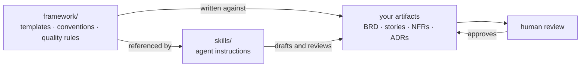

# analyst-toolkit

Templates, quality rules and agent skills for requirements work — built so that
the standards a human reviews against and the instructions an agent follows are
the same text.

> **Work in progress.** This is v0.1 and is being built in the open. Files will
> change, structure will move, and several planned parts are not here yet — see
> [Roadmap](#roadmap). Nothing is stable enough to depend on without reading it
> first. Feedback and disagreement are welcome; open an issue.

---

## The problem

Most teams have both of these, separately: a set of documentation standards
nobody quite follows, and a growing pile of prompts that generate requirements
in whatever shape the prompt happened to describe. The standards are read once.
The prompts are never reviewed at all. Within a few months they say different
things, and the artifacts that come out satisfy neither.

Adding an AI drafting step to that arrangement does not fix it. Generated
requirements read as complete because fluent text reads as complete — gaps get
filled with plausible values instead of being flagged, and the resulting number
becomes a commitment the moment somebody reads it.

This repository is one attempt at the other arrangement: the templates and the
agent instructions are the same artifacts, and nothing certifies its own output.

---

## How it fits together

Skills point at the framework files rather than restating their contents.
Updating a template changes what the skills do, without editing any skill.

---

## Contents

| | What it is |
|---|---|
| [`framework/`](framework) | Templates for BRDs, user stories, NFR catalogues and decision records; identifier conventions; a definition of ready and a review checklist |
| [`skills/`](skills) | Agent skills that draft and review against those templates. [Start here](skills/README.md) if you have not used a skill before |
| [`NOTES.md`](NOTES.md) | What went wrong while building this. The most useful file in the repository |

---

## Quick start

**To use the templates**, take what you need from [`framework/`](framework).
They are plain Markdown with the guidance written into each section — no tooling,
no setup. Read
[`conventions/naming-and-ids.md`](framework/conventions/naming-and-ids.md) first
if you plan to use more than one.

**To use a skill**, follow [`skills/README.md`](skills/README.md). Roughly five
minutes, and it covers three ways to do it including one that requires no
installation at all.

---

## What this is not

- **Not a methodology.** It assumes you already know what a requirement is. It
  covers how to write one down so that two people read it the same way.
- **Not a replacement for review.** Every skill here refuses to approve its own
  output. That is deliberate and is not going to change.
- **Not tool-specific.** The framework is Markdown. The skills follow an open
  standard and work with any assistant that supports it.
- **Not a portfolio.** Take it, fork it, strip out what does not fit.

---

## Design principles

**Guidance lives in the template.** Each template explains what its sections are
for and what makes them wrong. A separate style guide is read once and then
drifts from practice; guidance at the point of writing is read every time.

**Unknown is a valid answer.** Every template has a place to record that
something is not yet known, with an owner and a date. A recorded unknown is a
visible risk. A plausible invention is an invisible commitment.

**Nothing certifies itself.** The author of a requirement cannot see what they
assumed. Neither can a model that just drafted one. Output is a draft awaiting
review, however complete it looks.

**Skills are tested against fixtures.** Each skill ships with deliberately
defective documents and answer keys. A skill that has never been run against
known-bad input is a guess about its own behaviour.

---

## Roadmap

Present:

- Framework — templates, conventions, quality rules
- `requirements-smell-detector` — reviews requirements for ambiguity, with two
  test fixtures

Planned, in rough order:

- `brd-drafter` — turns a short business request into a structured draft, with
  gaps flagged rather than filled
- `nfr-interrogator` — interviews for quality attributes across the eight
  catalogue categories
- A worked end-to-end example: raw request through draft, review and NFR
  interview to a finished document, including what the agents got wrong
- Traceability checks — orphan detection across the identifier graph

---

## Contributing

Issues are the most useful contribution right now, particularly:

- A finding one of the skills got wrong on your own requirements
- A template section that did not survive contact with a real project
- A defect class the smell detector misses

Pull requests are welcome for anything already in the roadmap.

---

## License

MIT. See [LICENSE](LICENSE).

The templates are documents rather than software, and MIT applies to them
awkwardly; if that matters for your use, treat them as CC BY 4.0 — attribution
appreciated, no other restriction intended.
