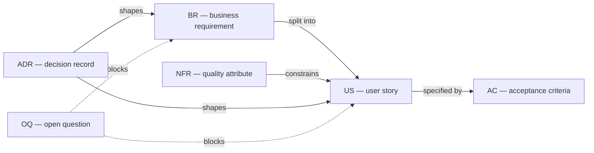

# Framework

Templates, conventions and quality rules for requirements work. Plain Markdown,
no tooling required, designed to be referenced by agent skills rather than
copied into them.

---

## Contents

| File | What it is | Use it when |
|---|---|---|
| [`conventions/naming-and-ids.md`](conventions/naming-and-ids.md) | Identifier scheme and link types | Setting up a workspace, before the first artifact exists |
| [`templates/brd.md`](templates/brd.md) | Business requirement | A business need is accepted for analysis |
| [`templates/user-story.md`](templates/user-story.md) | User story with acceptance criteria | Breaking a requirement into deliverable slices |
| [`templates/nfr-catalog.md`](templates/nfr-catalog.md) | Non-functional requirements, eight categories | Establishing quality attributes for a system or capability |
| [`templates/adr.md`](templates/adr.md) | Analysis decision record | A choice with more than one viable option is made |
| [`quality-rules/definition-of-ready.md`](quality-rules/definition-of-ready.md) | Entry gate for delivery | Deciding whether an item may enter a sprint |
| [`quality-rules/review-checklist.md`](quality-rules/review-checklist.md) | Second-reader checklist | Reviewing any artifact before it is agreed |

---

## How the artifacts relate

Links are declared in each artifact's `traces` field using the relationship
types defined in the naming convention. Nothing else maintains the graph, which
is why identifiers are never reused and never renumbered.

---

## Working order

1. **Set conventions first.** Identifier scheme before the first document,
   because renaming later breaks every link that already points at it.
2. **Establish the NFR catalogue once per system**, not per requirement.
   Individual artifacts reference entries and record only what differs.
3. **Write the BRD before splitting.** Stories written without a business
   requirement above them tend to describe screens.
4. **Record a decision the moment it is made**, not when the document is
   finished. Reasoning decays within days.
5. **Review before agreeing, gate before delivering.** The review checklist
   asks whether the writing holds up; Definition of Ready asks whether the item
   may enter a sprint. They are different questions asked at different moments.

---

## Status lifecycle

Every artifact carries a `status`. Statuses are not decoration — they determine
what may happen to the artifact next.

| Status | Meaning | May move to |
|---|---|---|
| `draft` | Being written; incomplete by design | `needs-info`, `in-review` |
| `needs-info` | Blocked by an unanswered question with a named owner | `draft`, `in-review` |
| `in-review` | With a second reader; findings outstanding | `draft`, `needs-info`, `approved` |
| `approved` | Agreed and safe to build against | `superseded` |
| `superseded` | Replaced by a later artifact, kept for the record | — |

**What must be true to reach `approved`:**

- Every review finding classed *blocking* or *should fix* is resolved or
  explicitly declined with a reason
- Every open question is answered, or converted to a recorded default with the
  owner named
- `traces` point only at identifiers that exist
- Decisions taken during drafting are recorded as ADRs and linked, not left in
  the prose
- A second reader has approved it — never the author, and never the tool that
  drafted it

**`superseded`, not deleted.** A replaced artifact keeps its identifier and
gains a pointer to its replacement. Deleting it breaks every link that pointed
at it and erases the reasoning that produced the replacement.

**Approval does not freeze an artifact.** Change is normal; unrecorded change is
not. A material change to an `approved` artifact returns it to `in-review` and
appends to its change log.

---

## Design principles

**Guidance lives in the template, not beside it.** Each template explains what
its sections are for and what makes them wrong. Separate style guides are read
once and then diverge from practice; guidance at the point of writing is read
every time.

**Unknown is a valid answer.** Every template has a place to record that
something is not yet known, with an owner and a date. A recorded unknown is a
visible risk. A plausible invention is an invisible commitment, and it is worse
than a blank.

**No artifact certifies itself.** The author of a requirement cannot see what
they assumed. This applies unchanged to generated drafts: output is a draft
awaiting review, however complete it appears, and status advances only on human
approval.

**Fewer relationship types than feel necessary.** Four link types cover the
useful cases. A richer vocabulary makes the graph more expressive and less
likely to be maintained.

---

## Adapting this

The parts most likely to need changing for a given organisation:

- **Identifier prefixes**, if an existing tracker already owns them
- **Status names**, to match whatever workflow is already in use
- **NFR categories**, which are eight here because eight covers most systems —
  regulated domains usually need a ninth for compliance evidence
- **Definition of Ready criteria 11–15**, which assume interfaces and persisted
  data are in scope

The parts worth keeping as they are: identifiers being stable, unknowns being
recordable, and nothing approving itself.
