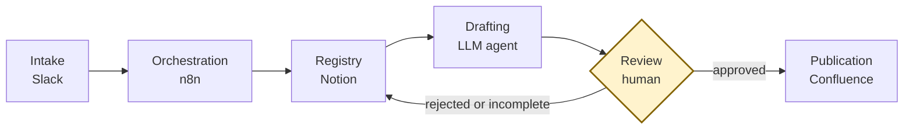

# Pipeline

A reference implementation of a human-in-the-loop pipeline that turns informal business requests into reviewed documentation, and the design record explaining why it is built the way it is.

Slack for intake, n8n for orchestration, Notion as the request registry, an LLM agent for drafting, Confluence for publication, and a human decision that no automated component can bypass.

## Read this first

**The tooling is real. The business context is synthetic.** Request types, reviewer roles, SLA values and thresholds describe a fictional mid-size payment service provider. They are constructed to exercise the routing logic, not drawn from any production system.

**There are no measured figures anywhere in this directory.** `metrics.md` defines a measurement design: what to instrument and what distorts each number. It reports no results, because illustrative numbers get remembered as findings.

**The workflow export is sanitised and will not run as supplied.** Every credential, endpoint and identifier is a placeholder. `workflow/env.example` lists what must be substituted; `workflow/SANITIZATION.md` is the checklist that produced it and is reusable against any n8n export.

## The problem

Business requests arrive as chat messages, get resolved in threads, and the reasoning evaporates. The obvious fix is to automate documentation, and the obvious fix has a failure mode worse than the original: plausible pages produced at volume, published unreviewed, filling the documentation space with material that is confidently wrong. That failure looks solved, which is what makes it worse.

This pipeline automates generation and refuses to automate judgement. The structural expression of that is a single constraint: **no automated actor can write the `Published` status.** The agent holds no credentials, cannot reach the registry or the documentation platform, and every write is performed by n8n on its behalf. There is no timeout that approves, no request type that skips review, and no confidence signal from the agent that shortens the path.

Everything left of the diamond is automated. Everything right of it follows from a human choice.

## Contents

| File | What it holds |
|---|---|
| `architecture.md` | Stage model, flow and lifecycle diagrams, trust boundaries, per-stage contracts. The vocabulary source for everything else |
| `routing-matrix.md` | Six request types, reviewer assignment, publication modes, escalation, and why each assignment is what it is |
| `agent-contract.md` | The drafting agent instruction under a seven-parameter structure, untrusted input handling, and what happens when the contract is violated |
| `decision-log.md` | Eleven decision records, each with the rejected alternatives and the conditions that would justify revisiting |
| `not-automated.md` | What is held by humans on purpose, what is simply missing, and which tempting automations were rejected |
| `metrics.md` | Measurement design: what to instrument, what distorts it, and what is deliberately not measured |
| `workflow/n8n-workflow.sanitized.json` | The 24-node workflow export |
| `workflow/SANITIZATION.md` | Field-by-field checklist for stripping an n8n export before publication |
| `workflow/env.example` | Every placeholder, the credentials to create, the registry schema, and the known gaps |

## Where to start

**To evaluate the design:** `architecture.md`, then PDR-004 in `decision-log.md`, then `not-automated.md`. Those three carry the argument.

**To reuse the pattern:** `architecture.md` for the stage model, `routing-matrix.md` for how routing policy is kept reviewable by non-engineers, `agent-contract.md` for the instruction structure. The specific request types are disposable; the separation of drafting from judgement is not.

**To publish your own n8n workflow:** `workflow/SANITIZATION.md` stands alone and needs nothing else from this directory.

**To run it:** you cannot, as supplied, and that is deliberate. `workflow/env.example` section 4 lists what is missing beyond configuration, including webhook signature verification and concurrency-safe identifier generation.

## Known weaknesses

Named here rather than left in footnotes, because a reference implementation that presents itself as complete is misleading.

- **Knowledge pack content enters the agent's instruction.** Write access to the documentation space is therefore effectively write access to the agent. This is the highest-value unaddressed risk in the design.
- **Nothing detects knowledge pack drift.** Drafting quality decays gradually rather than failing.
- **Reviewer attribution is role-level.** Resume links are bearer capabilities in a shared channel; the pipeline cannot detect that an approver is also the requester. PDR-010 states the limitation and does not survive contact with a real audit obligation.
- **The approval gate compels a click, not a reading.** It cannot prevent rubber-stamping. `metrics.md` proposes indicators intended to make it visible, all of them proxies.
- **Delimiters are a convention, not a boundary.** Untrusted input handling makes instruction-following far less likely, not impossible. Nothing here depends on it holding, which is why the full instruction is published (PDR-012).

## Relation to the rest of this repository

`framework/` holds the artifact templates. `skills/` holds agent skills that produce and review individual artifacts. This directory holds the operational layer: what happens when those artifacts are produced continuously, by a system, at a volume where the binding constraint stops being drafting and becomes review.

The drafting agent's core obligation is the same one the `brd-drafter` skill is built on: report what is absent rather than filling it. An artifact that looks complete passes review by looking complete.

Aligned with `framework/`:

- Request identifiers follow `framework/conventions/naming-and-ids.md`: `BR-<NNN>`, one global sequence, zero-padded, never reused, never renumbered.
- Decision records follow the structure of the framework ADR template, under the `PDR-` prefix. See `decision-log.md` for why the prefix differs.
